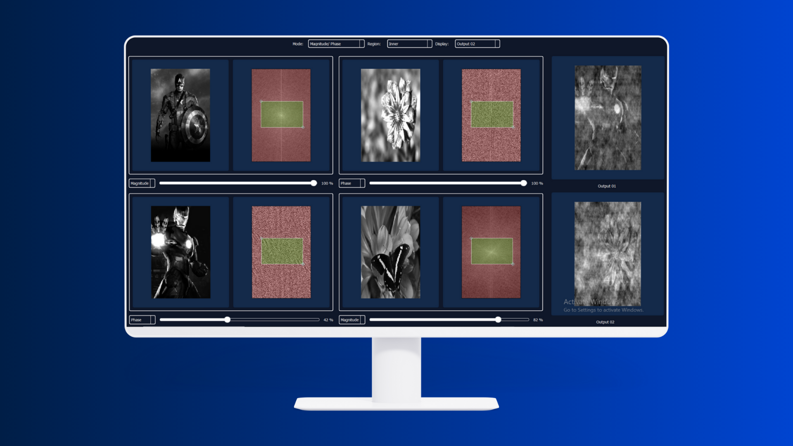
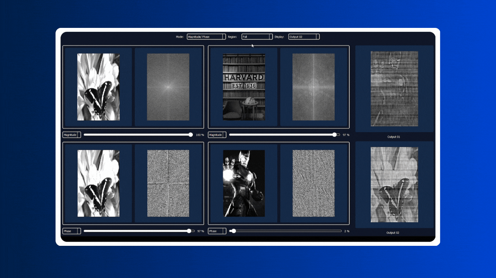
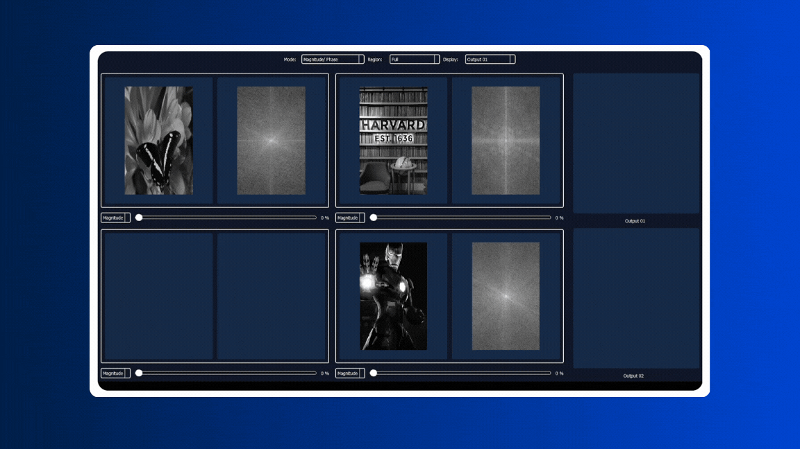

# Fourier Transform Mixer



The Fourier Transform Mixer is an interactive application designed to visualize and manipulate the magnitude and phase components of images. By separating and recombining these components, users can explore the impact of Fourier transforms in image processing and understand the relationship between image structure, frequency content, and phase information.

---

## Features

### 1. Real-Time Image Processing
- **Interactive Magnitude and Phase Adjustments:**
  - Adjust the magnitude and phase components of two input images using sliders.
  - Observe the real-time effects of combining different magnitudes and phases.

- **Region Selection:**
  - Focus on specific regions within the frequency domain (e.g., inner or outer regions) to localize edits and isolate effects.
  
### 2. Multiple Display Modes
- View and compare outputs generated by combining magnitude and phase components:
  - **Magnitude Only**
  - **Phase Only**
  - **Mixed Outputs (e.g., Magnitude of Image A with Phase of Image B)**

### 3. Predefined Scenarios
- **Common Image Pairs:**
  - Experiment with classic image pairs (e.g., natural images and portraits).
  - Evaluate how phase dominates in defining an image's structure, while magnitude refines details.

---
## Preveiw:
 **Inner and Outter ROI Control**
  - 
 **Realtiem Contrast control**
  - 

**Realtiem Mixing**
  - 

## Getting Started

### 1. Setup Instructions

#### Clone the Repository
```bash
git clone https://github.com/YourUsername/Fourier-Transform-Mixer.git
```

#### Navigate to the Project Directory
```bash
cd Fourier-Transform-Mixer
```

#### Install Required Packages
```bash
pip install -r requirements.txt
```

#### Run the Application
```bash
python main.py
```

### 2. Basic Usage

1. **Load Input Images:**
   - Upload two grayscale images for processing.

2. **Adjust Magnitude and Phase:**
   - Use sliders to modify the magnitude and phase components.
   - View immediate updates in the output panels.

3. **Select Frequency Regions:**
   - Toggle between inner and outer regions in the frequency domain.

4. **Analyze Outputs:**
   - Compare how different combinations affect the visual appearance.

---

## Visualizations

### Magnitude and Phase Adjustments
- The application displays:
  - The original images.
  - The modified frequency domain representations.
  - Reconstructed images based on selected magnitude and phase combinations.

### Output Examples
- **Output 1:** Image with combined magnitude from Image A and phase from Image B.
- **Output 2:** Image with combined magnitude from Image B and phase from Image A.

---

## Dependencies

The Fourier Transform Mixer relies on the following technologies and libraries:

| **Dependency**       | **Description**                                       |
|-----------------------|-------------------------------------------------------|
| Python 3.x           | Core programming language.                            |
| NumPy                | Numerical computations for signal processing.         |
| PyQt5                | GUI framework for building desktop applications.      |
| pyqtgraph            | Fast plotting and 2D visualization in PyQt.           |
| matplotlib           | Visualization library for plotting and analysis.      |
| OpenCV (cv2)         | Computer vision library for image manipulation.       |
| logging              | Python standard logging module for debugging.         |

## Contributors <a name="Contributors"></a>
<table>
  <tr>
    <td align="center">
      <a href="https://github.com/Mostafaali3" target="_blank">
        
        <br />
        <sub><b>Mostafa Ali</b></sub>
      </a>
    </td>
    <td align="center">
      <a href="https://github.com/Youssef-Abo-El-Ela" target="_blank">
        
        <br />
        <sub><b>Youssef Abo El-Ela</b></sub>
      </a>
    </td>
    <td align="center">
      <a href="https://github.com/karreemm" target="_blank">
        
        <br />
        <sub><b>Kareem Abdel Nabi</b></sub>
      </a>
    </td>
    <td align="center">
      <a href="https://github.com/AhmedXAlDeeb" target="_blank">
        
        <br />
        <sub><b>Ahmed AlDeeb</b></sub>
      </a>
    </td>
  </tr>
</table>
Thank you for using the Fourier Transform Mixer! Feel free to contribute or reach out with feedback.

